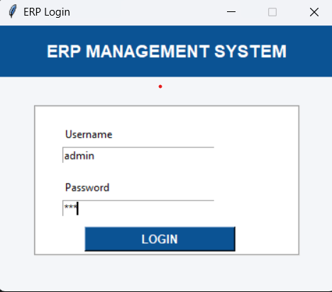
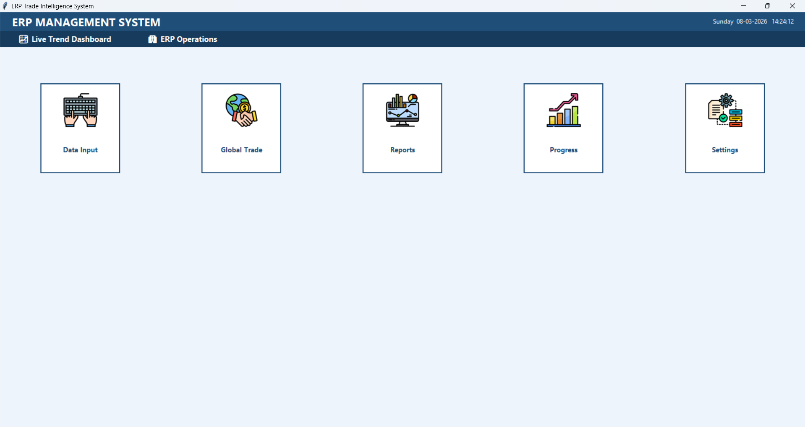
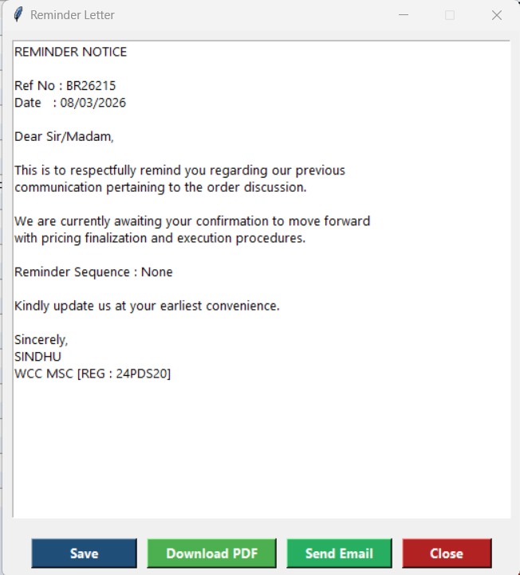

# SmartTrade BOQ System

## Overview
SmartTrade BOQ System is a Python-based desktop application developed for BOQ workflow management and business document automation using Tkinter and SQLite.

The application streamlines buyer-related workflows, automates business communication letters, manages BOQ records, and provides interactive analytical dashboards through a modular GUI interface.

---

## Features
- Secure Login Authentication
- BOQ Form Management
- Buyer Master Record Handling
- Initial Letter Generation
- Follow-Up Letter Automation
- Reminder Letter Generation
- Product Analytics Dashboard
- Live Trend Dashboard Visualization
- PDF Report Generation
- Modular Tkinter-Based GUI
- SQLite Database Integration

---

## Technologies Used
- Python
- Tkinter
- SQLite
- ReportLab / PDF Utilities

---

## Project Structure

```text
SmartTradeERP_BOQsystem/
│
├── assets/
├── database/
├── reports/
├── ui/
├── main.py
├── db_setup.py
└── README.md
```

---

# Application Screenshots

## Login Page


---

## Main Dashboard


---

## BOQ Full Form


---

## BOQ Master Records


---

## BOQ Letter


---

## Follow-Up Letter


---

## Reminder Letter


---

## Initial Letter


---

## Product Analytics Dashboard


---

## Live Trend Dashboard


---

## How to Run

```bash
python main.py
```

---

## Author
Sindhu S